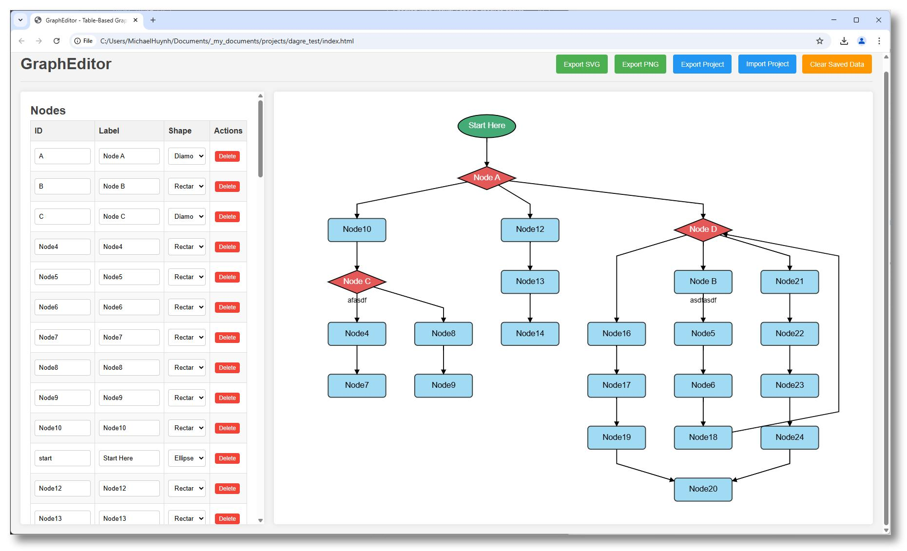

# GraphEditor

A simple, web-based graph editor that allows users to define graph structures using tables and visualize them using Dagre.js for layout and D3.js for rendering.

## Features

*   **Table-Based Editing:**
    *   Add, edit, and delete nodes directly in a table.
    *   Define node ID, label, and shape (Rectangle, Ellipse, Diamond).
    *   Add, edit, and delete edges in a table, specifying source, target, and label.
    *   Dropdowns for selecting existing nodes as edge sources/targets.
*   **Interactive Visualization:**
    *   Real-time updates to the SVG graph visualization as data is changed.
    *   Layout automatically handled by Dagre.js.
*   **Customization:**
    *   **Layout:** Control graph direction (Top-to-Bottom, Left-to-Right, etc.), node separation, and rank separation.
    *   **Node Appearance:**
        *   Set common border width, font family, and font size for all nodes.
        *   Configure shape-specific settings (width, height, fill color, text color, border color) for Rectangles, Ellipses, and Diamonds individually.
    *   **Edge Appearance:**
        *   Set edge line color, line width, text color, font family, and font size.
*   **Tooltips:** Hover over table inputs (Node ID/Label/Shape, Edge Source/Target/Label) to see the full value if truncated.
*   **Persistence:** Automatically saves the current graph state (nodes, edges, settings) to the browser's local storage and reloads it on the next visit.
*   **Import/Export:**
    *   Export the current graph visualization as an SVG or PNG file.
    *   Export the entire project (nodes, edges, and all settings) as a JSON file.
    *   Import a previously exported project JSON file to restore the editor state.
*   **Clear Data:** Option to clear all saved data from local storage.

## Technologies Used

*   HTML5
*   CSS3
*   JavaScript (ES6+)
*   [D3.js](https://d3js.org/) (v7): For SVG rendering and manipulation.
*   [Dagre.js](https://github.com/dagrejs/dagre): For directed graph layout.
*   [FileSaver.js](https://github.com/eligrey/FileSaver.js/): For triggering file downloads (exports).

## How to Use

1.  Clone or download this repository.
2.  Open the `index.html` file in a modern web browser (like Chrome, Firefox, Edge, Safari).
3.  Use the tables and settings panel on the left to define and customize your graph.
4.  The graph visualization will update automatically on the right.
5.  Use the buttons in the header to export your work or manage project files.

## Development Notes

*   The application state (nodes, edges, settings) is managed in a single JavaScript object (`state`).
*   Changes in the UI trigger updates to the `state` object, which then triggers a regeneration (`generateGraph`) and re-rendering (`renderSvgGraph`) of the visualization.
*   Local storage is used for simple persistence between sessions.